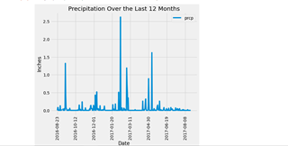
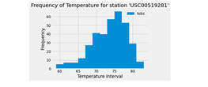

# sqlalchemy

## Step 1 - Climate Analysis and Exploration

Python and SQLAlchemy are used to do basic climate analysis and data exploration of a climate database. All of the following analysis is completed using SQLAlchemy ORM queries, Pandas, and Matplotlib.

### Precipitation Analysis

* A query is designed to retrieve the last 12 months of precipitation data.

* Only the `date` and `prcp` values are selected.

* Query results are loaded into a Pandas DataFrame with the index being the date .

* DataFrame values are sorted by `date`.

* Results are plotted using the DataFrame `plot` method.

  

* Pandas is used to print the summary statistics for the precipitation data.

### Station Analysis

* A query is designed to calculate the total number of stations.

* The most active stations are found using a query and:

  * The stations and observation counts are listed in descending order.

  * The station with the highest number of observations is found?

* A query is designed to retrieve the last 12 months of temperature observation data (TOBS).

  * The station with the highest number of observations is found using a filter.

  * The results are plotted as a histogram with `bins=12`.

    

- - -

## Step 2 - Climate App

A Flask API is designed based on the queries developed above.

* Flask is used to create the routes.

### Routes

* `/`

  * Home page with all routes available listed.

* `/api/v1.0/precipitation`

  * Query results are converted to a dictionary using `date` as the key and `prcp` as the value and returned as a JSON list.

* `/api/v1.0/stations`

  * Returns a JSON list of stations from the dataset.

* `/api/v1.0/tobs`
  * Queries the dates and temperature observations of the most active station for the last year of data.
  
  * Returns a JSON list of temperature observations (TOBS) for the previous year.

* `/api/v1.0/<start>` and `/api/v1.0/<start>/<end>`

  * Returns a JSON list of the minimum temperature, the average temperature, and the max temperature for a given start or start-end range.

